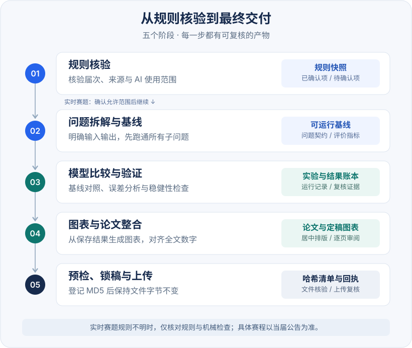
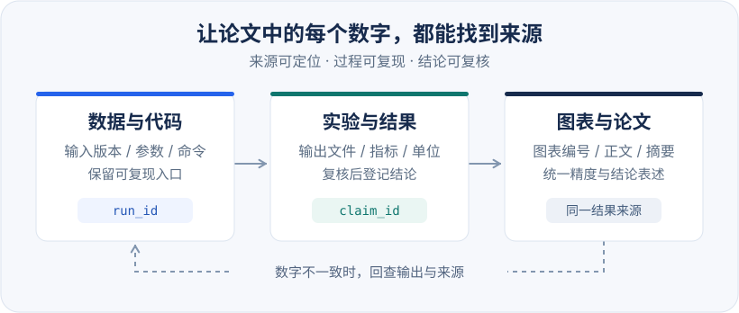

<p align="center">
  <a href="assets/readme-banner.svg"></a>
</p>

<h1 align="center">华为杯研究生数模助手</h1>

<p align="center">
  <strong>去除 AI 痕迹，让论文表达更自然。</strong><br />
  面向华为杯论文的 AI 痕迹评阅、去 AI 味与学术表达润色
</p>

<p align="center">
  <a href="https://github.com/Nopon-Knowledge/huawei-cup-modeling-skill/actions/workflows/tests.yml"></a>
  
  
  <a href="LICENSE"></a>
</p>

<p align="center">
  <a href="#去除-ai-痕迹"><strong>去除 AI 痕迹</strong></a> &nbsp;·&nbsp;
  <a href="#快速开始">快速开始</a> &nbsp;·&nbsp;
  <a href="#ai-痕迹检测与分级">检测与分级</a> &nbsp;·&nbsp;
  <a href="#竞赛工作流">竞赛工作流</a> &nbsp;·&nbsp;
  <a href="#图表与论文">图表与论文</a> &nbsp;·&nbsp;
  <a href="#脚本工具">脚本工具</a>
</p>

---

本 Skill 重点提供 **“去除 AI 痕迹”** 功能：找出重复套话、机械段落与空泛结论，改写为具体、连贯的学术表达，并对照核查事实、公式和引用。

同时支持规则核验、可复现建模、图表排版与提交审计，覆盖华为杯从准备到交付的工作流程。

<table align="center">
  <tr>
    <th align="center" width="280">定位问题</th>
    <th align="center" width="280">完成改写</th>
    <th align="center" width="280">复核原意</th>
  </tr>
  <tr>
    <td align="center">原文证据<br />修改优先级</td>
    <td align="center">减少套话<br />梳理论证</td>
    <td align="center">数据公式<br />引用与边界</td>
  </tr>
</table>

## 去除 AI 痕迹

**从词句到篇章，减少模板感，保留队伍自己的研究判断。** 支持局部段落、图题、摘要、结论和整篇论文；已有写作样例时，保留作者的术语、人称与表达习惯。

<table align="center">
  <tr><th align="center">问题</th><th align="center">如何改写</th></tr>
  <tr><td>措辞</td><td>删去无信息的过渡和总结，明确主语、动作及实际逻辑关系。</td></tr>
  <tr><td>段落</td><td>按论证需要拆分或合并，减少机械的“总—分—总”。</td></tr>
  <tr><td>判断</td><td>写清有依据的模型取舍与适用范围，核对精度和误差表达。</td></tr>
  <tr><td>图文</td><td>图题说明条件或已验证发现，结论直接回答问题，避免复读摘要。</td></tr>
  <tr><td>风格</td><td>保留真实的解释与表达习惯，让每句话包含具体信息。</td></tr>
</table>

### 改写前后

<table align="center">
  <tr><th align="center" width="420">润色前 · 重复推进</th><th align="center" width="420">润色后 · 直接表达</th></tr>
  <tr>
    <td>本实验中，模型 A 的预测误差低于模型 B。在此基础上，我们进一步得出模型 A 优于模型 B 的结论。综上所述，模型 A 表现出更好的预测性能。</td>
    <td>本实验中，模型 A 的预测误差低于模型 B。</td>
  </tr>
</table>

<p align="center"><sub>示例仅演示表达改写：删除两次重复总结，保留比较对象、指标方向和实验范围；不代表结果已经核验。</sub></p>

默认交付 **改写稿 + 句级修改对照 + 实际存在的证据缺口**。可直接润色，也可先做 [AI 痕迹检测](#ai-痕迹检测与分级)，按“原句 → 修改理由 → 改写后 → 事实复核”处理问题。八类检查和完整方法见 [学术表达指南](huawei-cup-modeling/references/academic-writing.md)。

这里的“去除 AI 痕迹”指学术表达去模板化，保留必要的 AI 使用披露，不承诺通过检测。实时赛题须先核验当届 AI 使用范围。

## 快速开始

### 1. 安装 Skill

在 Codex 中发送：

```text
使用 $skill-installer 从下面的 GitHub 路径安装 huawei-cup-modeling：
https://github.com/Nopon-Knowledge/huawei-cup-modeling-skill/tree/main/huawei-cup-modeling
```

<details>
<summary><strong>手动安装与目录说明</strong></summary>

也可以把仓库中的整个 `huawei-cup-modeling/` 文件夹复制到以下任一位置，保留其中的脚本和参考资料。

<table align="center">
  <tr><th align="center">安装范围</th><th align="center">目录</th></tr>
  <tr><td>当前仓库</td><td><code>.agents/skills/huawei-cup-modeling/</code></td></tr>
  <tr><td>个人全局</td><td><code>~/.agents/skills/huawei-cup-modeling/</code></td></tr>
</table>

Codex 会自动检测 Skill 变更；若未出现，可重启。目录位置与调用方式见 [OpenAI Skills 官方文档](https://learn.chatgpt.com/docs/build-skills)。

</details>

### 2. 给论文去 AI 味

```text
$huawei-cup-modeling 请给这份华为杯论文去除 AI 痕迹：
逐段检查，定位到句子，处理套话、机械结构、空泛图题和重复结论。
保留原意、数据、公式、引用和已有写作风格，
给出改写稿、原句与修改对照、事实复核和未完成的核验项。
```

提供待改写文本或文件即可开始，局部段落也可以处理。Skill 会先识别任务阶段与规则范围，再完成相应润色。以上为 Codex 调用方式；在 ChatGPT 桌面端可用 `@` 选择已安装的 Skill，详见 [官方文档](https://learn.chatgpt.com/docs/build-skills)。

<details>
<summary><strong>其他竞赛任务：规则核验、往届题训练、团队规划与提交审计</strong></summary>

**规则核验**

```text
$huawei-cup-modeling 帮我核对当届华为杯报名、赛程和 AI 使用规则，
区分已确认、尚未发布和仅有往届先例的信息，并附上来源与核验日期。
```

**公开往届题训练**

```text
$huawei-cup-modeling 这是已经公开的往届赛题。
请拆解子问题、明确评价指标，设计一条覆盖全题的可复现基线。
```

**三人团队规划**

```text
$huawei-cup-modeling 根据当届已核验规则，为三人队制定竞赛计划，
给出角色分工、关键检查点、锁稿缓冲和模型失败时的降级方案。
```

**图表与论文润色**

```text
$huawei-cup-modeling 请基于保存的实验输出优化这些论文图表：
统一字体、配色、单位和有效数字，居中排版，并检查最终 PDF 的可读性。
保留原始数值，指出缺少实验记录或来源的位置。
```

**提交前审计**

```text
$huawei-cup-modeling 审计这份最终 PDF；
先从当届公告确认文件名、大小和匿名起始页，再执行机械预检。
```

</details>

## AI 痕迹检测与分级

需要先找到重点问题时，可使用 **AI 痕迹检测 → 定向改写 → 事实复核** 的流程。检测按九个维度观察，第十项综合评估；只要求检测时，先给报告，不改原文。

全文任务按章节逐段扫描，记录已检查段落和未完成位置。报告区分已确认问题、待核验疑点与已排除的正常表达；每条问题都能定位到句子或图表，不把候选疑点直接算成问题。

<details>
<summary><strong>查看十项检测内容</strong></summary>

<table align="center">
  <tr><th align="center">维度</th><th align="center">主要检查内容</th></tr>
  <tr><td>01 · 词汇</td><td>高频套话、空洞形容词、缺少具体动作的模板化动词。</td></tr>
  <tr><td>02 · 句式</td><td>句法重复、无效过渡、被动表达是否遮蔽必要主体。</td></tr>
  <tr><td>03 · 段落</td><td>均匀段长与固定结构是否导致冗余或打断论证。</td></tr>
  <tr><td>04 · 逻辑</td><td>推理跳步、过度概括、遗漏反例或适用边界。</td></tr>
  <tr><td>05 · 作者表达</td><td>需要解释选择时，是否缺少真实判断依据与取舍。</td></tr>
  <tr><td>06 · 数据</td><td>有效数字、误差含义与样本或验证范围。</td></tr>
  <tr><td>07 · 图表</td><td>空泛图题、配色辨识困难、单位与标注缺失。</td></tr>
  <tr><td>08 · 结构</td><td>摘要信息不足、章节未回应题目、结论无信息复读。</td></tr>
  <tr><td>09 · 引用</td><td>引文与主张是否对应、文献相关性及实际核验状态。</td></tr>
  <tr><td>10 · 综合</td><td>汇总 0–100 分、A–E 等级、材料覆盖与修改优先级。</td></tr>
</table>

</details>

```text
$huawei-cup-modeling 检测这篇华为杯论文的 AI 痕迹：
按十项流程逐段检查，定位到句子，报告扫描进度、证据与修改建议。
覆盖充分时给出综合分和 A–E 等级；有精确标注时计算问题文本覆盖率。
材料不足的项标为待核验；先给报告，不修改原文。
```

A–E 从低到高表示**模板化表达程度**。综合分是规则式编辑量表得分，不能换算为 AI 生成概率；只有片段或材料覆盖不足时，暂不给全文等级。规范的引用格式、默认配色、被动句和流畅逻辑本身不扣分。

### 体检报告包含什么

<table align="center">
  <tr><th align="center">内容</th><th align="center">可复核的依据</th></tr>
  <tr><td>检查进度</td><td>已检查段落、未完成章节，图表与引用的实际核验状态。</td></tr>
  <tr><td>问题位置</td><td>问题编号、句级原文、判断依据、待核验或已排除的原因。</td></tr>
  <tr><td>修改对照</td><td>需要润色时提供原句、修改理由、改写后及事实复核结果。</td></tr>
  <tr><td>覆盖统计</td><td>根据固定文本和标注区间去重计数，保留分子、分母与文本哈希。</td></tr>
</table>

**问题文本覆盖率**表示已确认问题涉及多少已检查文字，与 AI 来源概率无关。支持本地脚本复算；片段或未完成扫描不输出全文比例，待核验内容单列。

评分公式、等级阈值、证据记录和报告格式见 [AI 痕迹评阅指南](huawei-cup-modeling/references/ai-trace-review.md)。

### 交稿前集中自查

在内部锁稿前安排体检、定向改写、人工复核和最终导出，同时核对实际 AI 使用记录与当届披露要求。可预留约半天并按论文规模调整；时间不足时先处理关键问题，如实保留未检查范围。

本科国赛与华为杯的规则分别核验。声明放在哪里、详情材料叫什么、哪些情形有例外，都以**对应赛事当届官方文件**为准；[规则核验记录](huawei-cup-modeling/references/current-rules.md)说明了两者的区分。

## 竞赛工作流

先核验规则，再建立覆盖全题的基线；有了验证证据，再整合论文和锁定文件。**实时赛题须先确认当届 AI 允许范围**，各阶段按已核验规则执行。

<p align="center">
  <a href="assets/readme-workflow.svg"></a>
</p>
<p align="center"><sub>每一阶段都有对应产物；发现问题时回到相应阶段修正。点击图可查看原图。</sub></p>

三人分工、100 小时参考时间线、五个检查点和模型降级策略，见 [竞赛执行指南](huawei-cup-modeling/references/contest-operations.md)。时间安排是可调整的参考，赛程以当届公告为准。

## 图表与论文

**图表既要清楚，也要有据可查。** 从保存的实验结果生成图表，关联结果账本，再引用到正文和摘要，让每个定量结论都能回到一次具体运行。

<p align="center">
  <a href="assets/readme-evidence.svg"></a>
</p>
<p align="center"><sub>从数据到结论保留来源；复核后的同一结果，使用一致的单位、精度与表述。</sub></p>

<table align="center">
  <tr><th align="center">维度</th><th align="center">交付标准</th></tr>
  <tr><td><strong>选图</strong></td><td>围绕一个比较或结论选图；坐标、单位、图例、误差含义完整。</td></tr>
  <tr><td><strong>样式</strong></td><td>统一字体、字号和配色；颜色搭配线型或标记，缩小后仍可辨认。</td></tr>
  <tr><td><strong>居中</strong></td><td>图与表相对正文版心居中，多子图成组对齐；题注遵循官方模板。</td></tr>
  <tr><td><strong>导出</strong></td><td>统计图优先矢量格式；位图按最终尺寸导出，检查字体和边缘裁切。</td></tr>
  <tr><td><strong>溯源</strong></td><td>保留源数据、绘图脚本和运行标识；正文、摘要与图表数字一致。</td></tr>
</table>

图型选择、配色建议、Markdown / Word / LaTeX 居中方式和导出检查，见 [图表与排版指南](huawei-cup-modeling/references/figures-and-tables.md)；写作与逐层审计见 [论文整合指南](huawei-cup-modeling/references/paper-and-compliance.md)。

## 脚本工具

提供三个无第三方 Python 依赖的本地辅助脚本。以下命令在仓库根目录执行，**全大写参数值需要替换**为真实路径或已核验条件。

### 复算体检覆盖率

```bash
python3 huawei-cup-modeling/scripts/measure_review_coverage.py PAPER.txt ANNOTATIONS.json
```

读取冻结的 UTF-8 文本与标注 JSON，核验 SHA-256，按字符区间并集计算扫描进度、确认问题与待核验覆盖率。结果以 JSON 输出，输入文件保持原样。脚本只负责计数，语义问题由评阅过程识别；标注字段与统计口径见 [评阅指南](huawei-cup-modeling/references/ai-trace-review.md)。

### 初始化竞赛工作区

```bash
python3 huawei-cup-modeling/scripts/init_competition_workspace.py TEAM_WORKSPACE \
  --year CONTEST_YEAR \
  --title "项目名称"
```

生成规则快照目录、数据与图表目录、来源 / 实验 / 结果账本、AI 使用日志和提交清单，并保留已有文件。三人分工与时间安排按 [竞赛执行指南](huawei-cup-modeling/references/contest-operations.md)制定。

### 提交前预检

```bash
python3 huawei-cup-modeling/scripts/preflight_submission.py PAPER.pdf \
  --expected-name OFFICIAL_FILENAME.pdf \
  --max-paper-bytes VERIFIED_BYTE_LIMIT \
  --identity "学校名称" \
  --identity-start-page OFFICIAL_START_PAGE \
  --strict \
  --manifest HASH_REPORT.json
```

检查 PDF 结构、文件名、字节大小和指定页后的身份关键词，生成 MD5 与 SHA-256 清单。年度条件来自当届官方公告；若官方只写 MB 而未说明换算方式，应记录采用的约定，并把字节检查视为保守筛查。

<details>
<summary><strong>锁稿后验证文件是否变化</strong></summary>

```bash
python3 huawei-cup-modeling/scripts/preflight_submission.py PAPER.pdf \
  --expected-md5 RECORDED_MD5 \
  --strict
```

提交 MD5 后冻结对应字节文件；上传前核验同一文件，不再编辑、压缩或重导出。预检清单不覆盖已有文件，重做时使用新文件名。

</details>

## 环境与质量

<table align="center">
  <tr><th align="center">环境</th><th align="center">要求 / 用途</th></tr>
  <tr><td>Python 3.9+</td><td>运行脚本；无需第三方 Python 包</td></tr>
  <tr><td>macOS / Linux</td><td>GitHub Actions 覆盖的平台</td></tr>
  <tr><td>Poppler · <code>pdfinfo</code></td><td>PDF 结构检查</td></tr>
  <tr><td>Poppler · <code>pdftotext</code></td><td>身份关键词文本扫描</td></tr>
</table>

Poppler 需独立安装，本仓库不捆绑其二进制。工具缺失时，脚本会提示未完成的检查；启用 `--strict` 后，这类检查会被视为失败。

```bash
python3 -m unittest discover -s huawei-cup-modeling/tests -v
```

测试覆盖初始化回滚、链接防覆盖、已有清单保护、年度参数、字节边界、PDF 结构、身份词扫描、哈希验证，以及区间去重、片段覆盖限制、Unicode 偏移和标注版本校验。

<details>
<summary><strong>项目结构与资料入口</strong></summary>

```text
.
├── README.md
├── assets/                         # README 矢量封面与图示
└── huawei-cup-modeling/
    ├── SKILL.md                     # 任务路由与核心约束
    ├── agents/openai.yaml           # 界面元数据
    ├── references/
    │   ├── current-rules.md         # 带核验日期的年度快照
    │   ├── contest-operations.md    # 分工、时间线与检查点
    │   ├── figures-and-tables.md    # 图表质量、居中与导出
    │   ├── academic-writing.md      # 去 AI 味、表达润色与事实对照
    │   ├── ai-trace-review.md       # 九维检测、综合评分与 A–E 分级
    │   └── paper-and-compliance.md  # 论文、引用与提交审计
    ├── scripts/
    │   ├── init_competition_workspace.py
    │   ├── measure_review_coverage.py
    │   └── preflight_submission.py
    └── tests/
        ├── test_scripts.py
        └── test_review_coverage.py
```

</details>

## 使用边界

当届官方公告和附件优先，缓存快照用于定位检查项。实时赛题的 AI 规定或允许范围无法核验时，Skill 仅协助规则核对、材料整理和非实质性机械检查。数据、实验、文献与运行结果必须真实，关键假设和最终结论由队伍理解并确认。

脚本提供辅助证据，完整的模板、匿名和视觉版式仍需人工逐页复核。

<details>
<summary><strong>数据、隐私与哈希说明</strong></summary>

- 三个 Python 脚本自身不联网。通过 Codex 使用 Skill 时，材料可能由用户配置的 AI 服务处理，应遵守相应的数据控制与保留政策。
- 初始化工作区的 `.gitignore` 默认忽略竞赛材料目录。忽略规则不是访问控制，正式比赛材料仍应保存在受控位置。
- AI 使用日志只记录必要摘要，公开前须脱敏；不保存无关的完整对话。
- 哈希清单默认隐藏绝对路径与身份词原文，但仍含文件名、大小、时间和文件哈希，比赛期间不要公开。
- MD5 用于赛事要求的字节锁定流程，SHA-256 提供补充完整性证据；MD5 不作为安全哈希使用。

</details>

## 维护与贡献

[年度规则快照](huawei-cup-modeling/references/current-rules.md)需要持续核验。更新时采用竞赛官网、当届正式附件或培养单位通知，保留来源链接、发布日期和核验日期，明确区分已确认、尚未发布与往届先例。脚本参数变化应补充相应回归测试。

欢迎通过 [Issue](https://github.com/Nopon-Knowledge/huawei-cup-modeling-skill/issues) 或 Pull Request 提交规则更新、脚本修复和工作流改进。贡献内容不得包含实时未公开赛题、队内论文或数据、真实身份、完整 AI 对话、官方模板或 Logo，以及无权再授权的论文与代码。

<details>
<summary><strong>独立项目声明与许可证</strong></summary>

本项目是独立的开源辅助工具，与华为、中国研究生数学建模竞赛组委会、承办单位及研创网不存在隶属、授权或背书关系。“华为杯”等名称及相关商标归其权利人所有。

规则摘要用于定位检查项，不能替代当届官方公告、附件和系统提示，也不构成法律或竞赛合规意见。项目不保证规则始终准确及时，不保证匿名、模板、原创性、提交成功、获奖或 AI 使用一定被允许。

项目原创代码与文档采用 [MIT License](LICENSE)。外部链接、官方文件、赛事名称和商标的权利仍归各自权利人所有。Poppler 按其自身许可证提供。

</details>

---

<p align="center">
  <strong>让论文表达自然，让研究证据完整。</strong><br />
  <sub>定位模板感 · 改写机械表达 · 保留研究判断 · 复核事实原意</sub>
</p>
