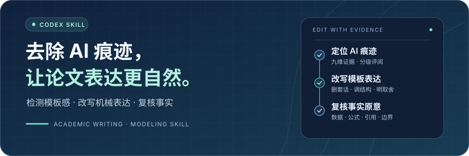
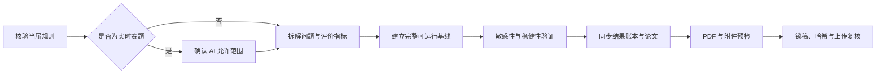

<p align="center">
  
</p>

<h1 align="center">华为杯研究生数学建模竞赛辅助 Skill</h1>

<p align="center">
  <a href="https://github.com/Nopon-Knowledge/huawei-cup-modeling-skill/actions/workflows/tests.yml"></a>
  
  
  
  <a href="LICENSE"></a>
</p>

<p align="center">
  面向 Codex 与 ChatGPT 桌面端的中文竞赛辅助 Skill。<br />
  把规则核验、建模协作、论文整合与提交审计串成一条可复核的工作流。
</p>

<p align="center">
  <a href="#快速安装">快速安装</a> ·
  <a href="#能力地图">能力地图</a> ·
  <a href="#竞赛工作流">竞赛工作流</a> ·
  <a href="#脚本工具">脚本工具</a> ·
  <a href="#安全边界">安全边界</a>
</p>

---

## 项目定位

数模竞赛的风险往往不只来自“模型不会做”，还来自规则误读、分工失控、结果不可追溯、论文数字漂移和提交文件出错。本项目把这些薄弱环节固化为可执行、可检查的流程。

| 常见风险 | 本项目的处理方式 | 产出 |
| --- | --- | --- |
| 把往届经验当作当届规则 | 分离官方规则、待发布信息与往届先例 | 带来源和核验日期的规则快照 |
| 模型能跑但无法复现 | 先做完整基线，再记录数据、参数和实验 | 可追溯的实验与结果账本 |
| 三人协作互相等待 | 提供角色分工、检查点、时间线与降级策略 | 可执行的 100 小时作战计划 |
| 论文数字前后不一致 | 统一结果来源，明确图表、正文和附件的对应关系 | 可审计的论文证据链 |
| 上传前才发现格式问题 | 对 PDF、文件名、体积、身份词和哈希做机械预检 | 提交清单与锁稿哈希 |

## 能力地图

| 场景 | Skill 会做什么 | 关键边界 |
| --- | --- | --- |
| 规则查询 | 核验当届官网、附件与校内通知，标记信息状态 | 不把推测写成硬性要求 |
| 赛前准备 | 设计分工、目录、账本、里程碑和应急降级 | 不预设尚未公布的阈值 |
| 公开往届题 | 拆题、设计基线、评价指标与稳健性实验 | 明确这是训练场景 |
| 实时赛题 | 先核验当届 AI 使用规定，再按允许范围协助 | 规则不明时不生成核心提交内容 |
| 论文整合 | 对齐假设、符号、模型、结果、图表和结论 | 不虚构数据、文献或运行结果 |
| 提交审计 | 检查结构、命名、大小、匿名信息与文件哈希 | 机械检查不能替代人工逐页复核 |

## 快速安装

### 方式一：通过 Skill Installer

在 Codex 中调用内置的 `$skill-installer`，从本仓库子目录安装：

```text
使用 $skill-installer 从下面的 GitHub 路径安装 huawei-cup-modeling：
https://github.com/Nopon-Knowledge/huawei-cup-modeling-skill/tree/main/huawei-cup-modeling
```

### 方式二：复制到本地

将 `huawei-cup-modeling/` 复制到以下任一位置：

| 安装范围 | 目录 |
| --- | --- |
| 当前仓库 | `.agents/skills/huawei-cup-modeling/` |
| 个人全局 | `~/.agents/skills/huawei-cup-modeling/` |

Codex 会自动检测 Skill 变更；若未出现，可重启 Codex。目录位置与调用方式以 [OpenAI Skills 官方文档](https://learn.chatgpt.com/docs/build-skills)为准。

安装后，可以从一次规则核验开始：

```text
$huawei-cup-modeling 帮我核对 2026 华为杯报名、赛程、AI 使用规则，
并区分“已确认”“尚未发布”和“仅有往届先例”的信息。
```

<details>
<summary><strong>查看更多调用示例</strong></summary>

公开往届题训练：

```text
$huawei-cup-modeling 这是已经公开的往届赛题。
请先拆解子问题，再设计一条能完整运行的可复现基线。
```

竞赛期间规划：

```text
$huawei-cup-modeling 根据当届已核验规则，为三人队制定 100 小时计划，
给出角色分工、关键检查点和模型失败时的降级方案。
```

论文一致性审计：

```text
$huawei-cup-modeling 检查论文中的符号、假设、图表和结论是否一致，
逐项指出缺少来源、实验记录或结果证据的位置。
```

提交前审计：

```text
$huawei-cup-modeling 审计这份最终 PDF；
先从当届公告确认文件名、大小和匿名起始页，再执行机械预检。
```

</details>

## 竞赛工作流



这条流程强调三个原则：先确认边界，再产出内容；先完成闭环，再追求复杂度；每个结论都能回到数据、代码或实验记录。

## 脚本工具

仓库提供两个无第三方 Python 依赖的辅助脚本。

### 初始化竞赛工作区

```bash
python3 huawei-cup-modeling/scripts/init_competition_workspace.py TEAM_WORKSPACE \
  --year CONTEST_YEAR \
  --title "项目名称"
```

脚本会生成规则快照、来源账本、实验账本、AI 使用日志、时间线和提交清单等基础文件，并避免覆盖已有内容。

### 提交前预检

```bash
python3 huawei-cup-modeling/scripts/preflight_submission.py PAPER.pdf \
  --expected-name OFFICIAL_FILENAME.pdf \
  --max-paper-bytes VERIFIED_BYTE_LIMIT \
  --identity "学校名称" \
  --identity-start-page OFFICIAL_START_PAGE \
  --strict \
  --manifest HASH_REPORT.json
```

它可以检查 PDF 结构、文件名、字节大小、指定页后的身份关键词，并生成 MD5 与 SHA-256 清单。锁稿后可用清单验证上传文件是否发生变化。

年度条件必须来自当届官方公告。若官方只给出 MB 而未说明换算方式，请记录采用的换算约定，并把字节检查视为保守筛查。

## 安全边界

| 本项目会坚持 | 本项目不会做 |
| --- | --- |
| 区分当届规则、待发布信息和往届先例 | 把经验帖或未公开阈值冒充官方规则 |
| 明示来源、不确定性和最后核验日期 | 虚构数据、实验、文献或代码运行结果 |
| 在实时赛题前先确认 AI 使用范围 | 规则未核验时生成核心模型或可提交正文 |
| 把脚本结果描述为辅助证据 | 把机械预检包装成完整合规证明 |
| 提供过程检查与风险提示 | 承诺获奖、提交成功或一定合规 |

### 数据与隐私

- 两个 Python 脚本自身不联网。通过 Codex 使用 Skill 时，提示词和材料可能由用户配置的 AI 服务处理，请遵守相应的数据控制与保留政策。
- 初始化脚本生成的 `.gitignore` 默认忽略赛题、数据、代码、实验、论文、日志和提交目录。忽略规则不是访问控制，正式比赛材料仍应保存在受控位置。
- AI 使用日志只记录必要摘要，不保存与任务无关的完整对话；公开日志前必须脱敏。
- 预检清单默认不记录绝对路径或身份词原文，但会包含文件名、大小、修改时间和文件哈希。它可能构成未公开论文的指纹，比赛期间不要公开。
- MD5 仅用于赛事要求的字节锁定流程，不应视为安全哈希；脚本同时记录 SHA-256 作为补充完整性证据。

## 环境与质量

| 项目 | 状态 |
| --- | --- |
| Python | 3.9 或更高版本 |
| 平台 | macOS、Linux |
| Python 第三方依赖 | 无 |
| PDF 结构检查 | Poppler `pdfinfo` |
| 身份文本扫描 | Poppler `pdftotext` |
| 自动化测试 | GitHub Actions + `unittest` |

缺少 Poppler 时脚本会提示未完成的检查；启用 `--strict` 后，这类检查会被视为失败。Poppler 由用户独立安装并按其自身许可证提供，本仓库不捆绑其二进制。

运行回归测试：

```bash
python3 -m unittest discover -s huawei-cup-modeling/tests -v
```

当前测试覆盖初始化回滚、符号链接与硬链接防覆盖、已有清单保护、年度参数、字节边界、PDF 结构、身份词扫描和哈希验证。

<details>
<summary><strong>查看项目结构</strong></summary>

```text
huawei-cup-modeling/
├── SKILL.md
├── agents/
│   └── openai.yaml
├── references/
│   ├── current-rules.md
│   ├── contest-operations.md
│   └── paper-and-compliance.md
├── scripts/
│   ├── init_competition_workspace.py
│   └── preflight_submission.py
└── tests/
    └── test_scripts.py
```

</details>

## 规则维护与贡献

`references/current-rules.md` 是带核验日期的年度快照，不是永久规则。更新时请：

1. 只采用竞赛官网、当届正式附件或培养单位的校内通知；
2. 区分已确认要求、尚未发布内容和往届先例；
3. 保留来源链接、发布日期和最后核验日期；
4. 为脚本参数变化补充回归测试；
5. 不提交实时竞赛中的未公开题目、论文、数据或队内材料。

欢迎通过 Issue 或 Pull Request 提交规则更新、脚本修复和工作流改进。贡献内容不得包含实时未公开赛题、队内论文或数据、真实身份、完整 AI 对话、官方模板或 Logo，以及无权再授权的论文与代码。

## 免责声明

本项目是独立的开源辅助工具，与华为、中国研究生数学建模竞赛组委会、承办单位及研创网不存在隶属、授权或背书关系。“华为杯”等名称及相关商标归其权利人所有。

仓库中的规则摘要仅用于帮助定位检查项，不能替代当届官方公告、附件和系统提示，也不构成法律或竞赛合规意见。项目不保证规则始终准确及时，也不保证匿名、模板、原创性、提交成功、获奖或 AI 使用一定被允许。人工逐页检查和官网复核不可替代。

项目原创代码与文档采用 [MIT License](LICENSE)。外部链接、官方文件、赛事名称和商标的权利仍归各自权利人所有。

---

<p align="center">
  <sub>先核验规则，再建立基线；让每个结论都能被复现，让每次提交都有迹可循。</sub>
</p>
